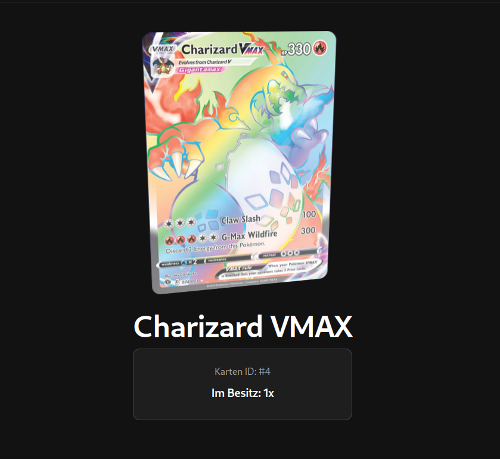
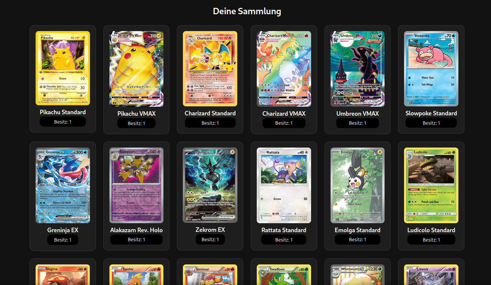

# Blockchain TCG

Monorepo for a MVP of a Blockchain-based Trading Card Game.

  
  

## Structure
- `smart-contracts/` — Solidity contracts (Remix / remixd workflow)
- `frontend/` — React frontend (react + ethers.js)
- `concept/` — Additional files (mockups, etc.)

## Notes
- Smart contracts are developed using Remix IDE. To work with your local file system, install remixd.
- `smart-contracts/` is treated as the root folder for Remixd when working with the local file system.
